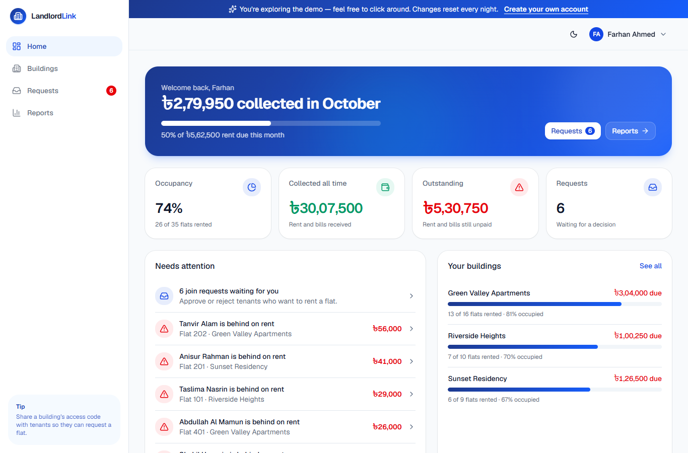
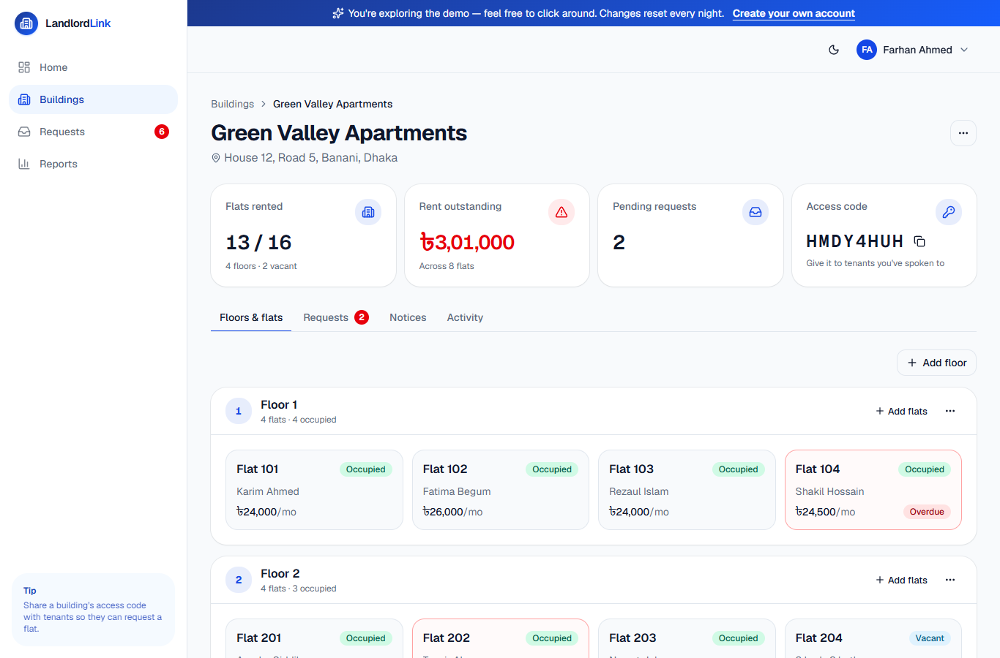
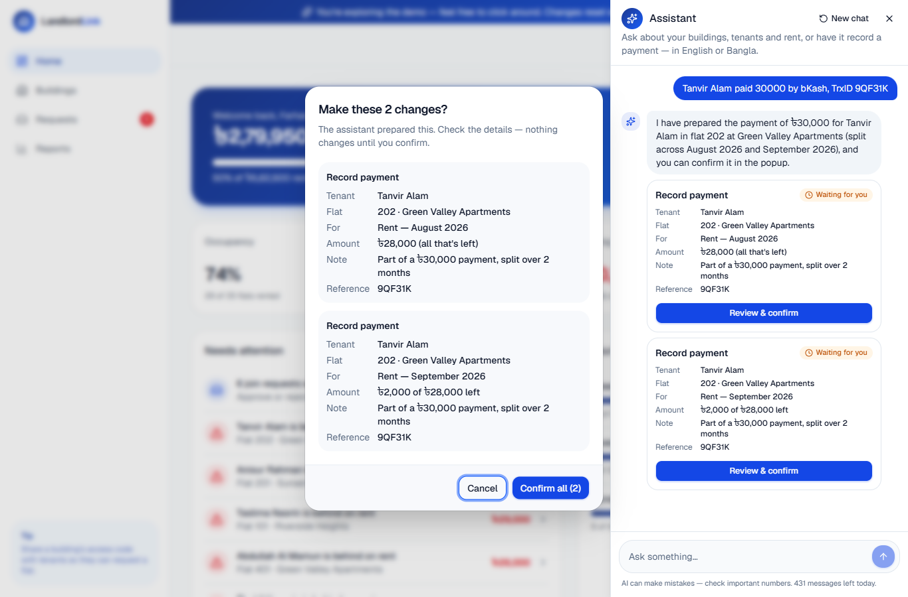
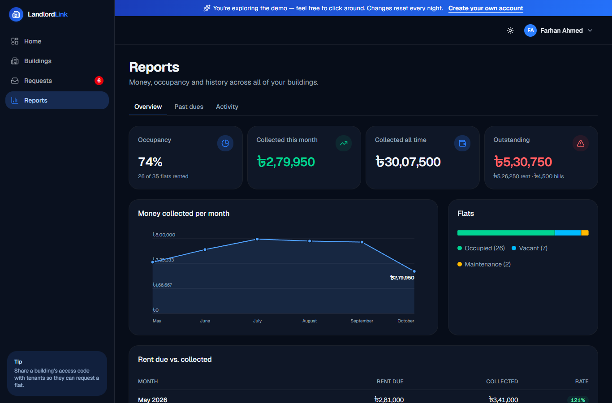

# LandlordLink

[](https://github.com/HasnainBilash/LandlordLink/actions/workflows/ci.yml)

A building management app for landlords and tenants, built with Next.js 16,
Prisma, PostgreSQL (Neon) and Auth.js.

Landlords manage buildings, floors, flats, tenants, leases, rent, utility
bills, notices and reports — and can ask an AI assistant to look things up
or record a payment for them. Tenants find a flat, request to join, and
follow their own rent, bills and notices.

**Try it:** the live site has **Try as landlord** and **Try as tenant**
buttons — one click, no sign-up. The demo resets every night.



| Building page | AI assistant | Reports (dark mode) |
|---|---|---|
|  |  |  |

---

## Project Status

🟢 Production-ready. The upgrade plan's five phases (speed and correctness,
simpler structure, modern design and public demo, AI assistant, production
hardening) are complete — see `docs/07_UPGRADE_PLAN.md`. New features are
planned next.

---

## Features

### Authentication

- Registration and login (Auth.js v5, JWT sessions)
- Password hashing (bcrypt)
- Landlord and tenant roles; protected routes
- Sign-in and sign-up rate limits (see [Security](#security))
- Server Actions with Zod validation

### Building Management

- Building, Floor, and Flat CRUD
- Quick Setup (bulk-generate floors + flats in one transaction)
- Building Access Codes

### Tenant Management

- Tenant Profiles
- Join Requests (search, request, approve/reject, end lease)
- Lease Management (open-ended — no fixed term)

### Finance

- Rent billed automatically every month, with status tracking (paid,
  partly paid, overdue, written off)
- Utility Bills
- Payment History (partial payments supported)
- Past dues: unpaid rent of former tenants, paid late or written off
- Reports (occupancy, revenue, outstanding balances, monthly trends)
- Money in taka with lakh grouping (৳2,79,950); dates in Bangladesh time

### Communication

- Notices (building-scoped, audience-targeted, auto-expiring)
- Unread notice badge for tenants

### Monitoring

- Activity Logs (building-scoped + a global landlord feed)
- Server errors logged as searchable JSON lines

### AI assistant (landlords)

- "Ask AI" panel on every landlord page: ask about rent, dues, flats,
  requests, notices and activity in English or Bangla
- Answers come from the landlord's own data through lookups scoped to
  their buildings; contact details and national IDs are never sent to the
  model
- Makes changes too — record a payment (split over the oldest unpaid
  months when it covers several), approve or reject a request, post a
  notice — but only prepares them: the landlord sees the exact details in
  a confirmation popup, and the change runs once, through the app's own
  server actions, only after they confirm (`AssistantAction`)
- Google Gemini (free tier) behind a small provider interface; falls back
  to the next model when one is busy
- Per-minute and daily message limits per landlord

### Public demo and phone support

- One-click demo accounts with realistic data, rebuilt every night
- Light and dark mode; works on phones (slide-out menu, no sideways
  scrolling)

---

## Tech Stack

| Area | Tools |
|---|---|
| Frontend | Next.js 16 (App Router), React 19, TypeScript, Tailwind CSS v4 |
| Backend | Server Actions, Route Handlers, Auth.js v5 (JWT), Zod |
| Database | PostgreSQL on Neon, Prisma ORM |
| AI | Google Gemini (`@google/genai`) with function calling |
| Testing | Vitest (unit), Playwright + PGlite (end-to-end) |
| Hosting | Vercel (Singapore region), Vercel Cron, GitHub Actions CI |

---

## Security

- **Every query is scoped to the signed-in user.** A landlord who opens
  another landlord's building or flat gets "Page not found"; pages never
  send password hashes, and tenants never see access codes.
- **Passwords:** bcrypt (cost 12). Signing in with an unknown email takes
  as long as with a wrong password, so the form can't be used to find out
  who has an account. Emails are matched without regard to case.
- **Rate limits**, stored in Postgres so they hold across serverless
  instances (`src/lib/rate-limit.ts`):

  | What | Limit |
  |---|---|
  | Wrong passwords for one email, from one network | 8 per 15 minutes |
  | Sign-in attempts from one network | 60 per 15 minutes |
  | New accounts from one network | 5 per hour |
  | Join requests per tenant | 10 per hour |
  | Assistant messages per landlord | 10 per minute, 50 per day |

- **Headers:** a Content Security Policy with a fresh nonce on every
  request (`strict-dynamic`; no framing, plugins or forms posting
  elsewhere), HSTS, `X-Content-Type-Options`, `X-Frame-Options`,
  `Referrer-Policy`, `Permissions-Policy` and `Cross-Origin-Opener-Policy`;
  no `X-Powered-By` (`src/proxy.ts`, `next.config.ts`).
- **Scheduled jobs** only accept Vercel's `Authorization: Bearer
  <CRON_SECRET>`, compared in constant time.
- **AI assistant:** sees only the landlord's own data, without phone
  numbers, emails or national IDs. Changes it prepares run only after the
  landlord confirms — exactly once (claimed in one atomic update, so double
  clicks and replays are refused) — and expire after 15 minutes.
- **Settings are checked when the server starts** (`src/lib/env.ts`): a
  missing or malformed setting stops it with a clear message.
- **Errors:** every server error is logged as one JSON line
  (`src/instrumentation.ts`) — the place to plug in Sentry or similar.
- **Dependencies:** `npm audit` reports one high-severity advisory in
  `deepmerge-ts`, which only Prisma's command-line tool uses (for
  migrations, during the build — the running app never loads it; Prisma 6
  has no fixed release), and advisories in ESLint's own dependencies
  (development only).

---

## Scheduled Jobs

Vercel Cron runs these every day (`vercel.json`):

| Job | Time (Bangladesh) | What it does |
|---|---|---|
| `/api/cron/bill-rent` | ~06:10 | Creates the month's rent for every active lease and marks unpaid rent from past months overdue |
| `/api/cron/reset-demo` | ~03:00 | Rebuilds the public demo |
| `/api/cron/cleanup` | ~03:30 | Deletes expired rate-limit counters, assistant usage older than 30 days and prepared changes older than 90 days |

On Vercel's Hobby plan a job runs at some point within its scheduled hour.
Rent is also billed when a lease starts, and pages that show rent run a
quick check (one round of reads; it writes only if the job hasn't caught
up yet), so a late job never shows stale rent.

---

## Getting Started

```bash
npm install                 # also generates the Prisma client
cp .env.example .env        # then fill it in (see below)
npm run db:migrate          # create the tables
npm run db:seed-test        # test accounts (see docs/TESTING.md)
npm run db:seed-demo        # the demo landlord and tenant
npm run dev                 # http://localhost:3000
```

| Command | What it does |
|---|---|
| `npm run dev` | Development server |
| `npm run build` / `npm start` | Production build / server |
| `npm run lint` / `npm run typecheck` | ESLint / TypeScript checks |
| `npm test` | Unit tests |
| `npm run test:e2e` | End-to-end tests (see [Testing](#testing)) |
| `npm run db:migrate` | Apply database migrations |
| `npm run db:seed-test` | Recreate the test accounts (only those) |
| `npm run db:seed-demo` | Rebuild the demo data (only that) |

### Public demo

The landing page has **Try as landlord** and **Try as tenant** buttons that
sign visitors in to two shared demo accounts (password `11111111`):

| Account | Email |
|---|---|
| Demo landlord | `farhan.ahmed@example.com` — 3 buildings, 26 tenants, months of rent history, requests, past dues |
| Demo tenant | `nusrat.demo@example.com` — lives in Green Valley Apartments, flat 203 |

`npm run db:seed-demo` creates or rebuilds the demo data. On Vercel it
also rebuilds itself every night (see [Scheduled Jobs](#scheduled-jobs)),
so visitors' changes disappear and dates stay current. Only demo data is
touched: the demo landlord's buildings, the two demo accounts (which keep
their IDs, so signed-in visitors stay signed in) and the generated tenants
on `@demo.example.com`.

---

## Environment Variables

Copy `.env.example` to `.env` and fill it in:

```env
# Neon pooled connection (host contains "-pooler") — used by the app
DATABASE_URL=
# Neon direct connection (same, without "-pooler") — used by prisma migrate
DIRECT_URL=
AUTH_SECRET=
# Any long random string; Vercel Cron sends it to the scheduled jobs
CRON_SECRET=
# AI assistant — free key from https://aistudio.google.com ("Get API key")
GEMINI_API_KEY=
```

Optional settings for the assistant:

| Variable | Default | What it does |
|---|---|---|
| `GEMINI_MODEL` | `gemini-3.5-flash-lite,gemini-3.1-flash-lite,gemini-3.8-flash` | Models to try, in order; the next one answers when one is busy |
| `ASSISTANT_DAILY_LIMIT` | `50` | Messages per landlord per day |
| `ASSISTANT_DEMO_DAILY_LIMIT` | `100` | Messages per day for the shared demo landlord |
| `ASSISTANT_PER_MINUTE_LIMIT` | `10` | Messages per landlord per minute |

Without `GEMINI_API_KEY` the app works as usual and the assistant says it
isn't set up. On Gemini's free tier Google may use the messages to improve
its products — fine for a demo; use a paid key for real tenants' data.

### Neon performance notes

- **Region:** create the Neon project in the same region as the app
  server (e.g. Vercel functions and Neon both in Singapore,
  `ap-southeast-1`). A region mismatch adds latency to *every* query.
- **Pooled URL:** always use the `-pooler` host for `DATABASE_URL`.
- **Cold starts:** Neon's free tier suspends the database after ~5
  minutes idle; the first request after that takes ~0.5–1s extra. On a
  paid plan you can disable scale-to-zero.

Apply migrations with `npm run db:migrate`.

---

## Testing

**Unit tests** — `npm test` (Vitest, about a second): rent months and the
late-join rule, payment status, money and date formatting, the assistant's
month parsing, tool loop and model fallback (with a stand-in model), cron
authentication, the settings check and rate-limit helpers.

**End-to-end tests** — `npm run test:e2e` starts a throwaway in-memory
PostgreSQL (PGlite), creates the tables with the real migrations, builds
and starts the app, loads test and demo data, and runs these suites in a
headless browser:

| Suite | What it checks |
|---|---|
| `01-read-paths` | Every page for both roles, the expected numbers, nothing leaked (password hashes, other landlords' data, access codes) |
| `02-landlord-flows` | Adding and editing buildings, floors and flats, payments, approvals, notices, write-offs, quick setup, a tenant requesting a flat |
| `03-more-flows` | Deletes that must be blocked, ending a lease that still owes, late payments, sign-up and request |
| `04-assistant` | The AI panel with an offline stand-in model: answers, limits, access rules, changes that wait for confirmation |
| `05-security` | Headers and CSP nonce, sign-in and sign-up limits, sign-in timing, scheduled-job authentication |
| `06-demo-reset` | The nightly demo reset; signed-in visitors stay signed in |
| `07-phone-layout` | No sideways scrolling at phone width, on 27 pages |
| `08-rent-billing` | The nightly rent billing and the page-view check |

It needs a browser: run `npx playwright-core install chromium` once, or
use one you have with `E2E_BROWSER_CHANNEL=msedge` (or `chrome`).
`npm run test:e2e -- --skip-build` reuses the last build, and
`npm run test:e2e -- assistant` runs only the suites whose name matches.
Logs and screenshots go to `e2e/output/`.

**CI** — GitHub Actions (`.github/workflows/ci.yml`) runs lint, type
checks, unit tests and a production build on every push and pull request,
then the end-to-end suites.

**By hand** — `docs/TESTING.md` has the test accounts and a checklist.

---

## Deploying to Vercel

The Vercel project's build command is `prisma migrate deploy && next build`,
so every deploy applies pending migrations first.

Environment variables (Vercel → **Settings → Environment Variables**):

| Variable | Environments | Notes |
|---|---|---|
| `DATABASE_URL` | Production, Preview | Neon pooled URL (`-pooler`) |
| `DIRECT_URL` | Production, Preview | Neon direct URL; without it the build fails with `Environment variable not found: DIRECT_URL` |
| `AUTH_SECRET` | Production, Preview | `npx auth secret` |
| `CRON_SECRET` | Production | For the scheduled jobs; must not end with a line break |
| `GEMINI_API_KEY` | Production, Preview | For the AI assistant |

The scheduled jobs appear under **Settings → Cron Jobs**, where each one
can also be run by hand (**Run**). `vercel.json` pins the app's functions
to Singapore (`sin1`), next to the Neon database.

---

## Project Structure

See `docs/02_ARCHITECTURE.md` for the complete project architecture.

---

## Documentation

Project documentation is in the `docs/` directory:

- Project Memory
- Roadmap
- Architecture
- Database
- Changelog
- Conventions
- Navigation & UX
- Upgrade Plan
- Testing Guide

---

## Development Philosophy

This project prioritizes:

- Clean Architecture
- Production-ready code
- Reusable Components
- Type Safety
- Scalability
- Maintainability

---

## License

Private project.
